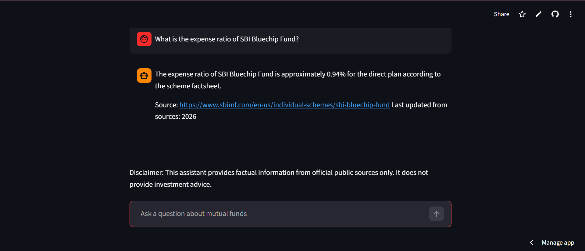

# RAG-based Mutual Fund FAQ Assistant

This project is a **Retrieval-Augmented Generation (RAG) chatbot** that answers factual questions about mutual fund schemes using **official public sources only**.

It was built as part of the **NextLeap Learn In Public (LIP) Challenge – Milestone 1**.

---

# Problem

Retail investors and support teams often need quick answers to factual mutual fund questions such as:

- Expense ratio of a scheme
- ELSS lock-in period
- Exit load
- Minimum SIP amount
- How to download capital gains statements

These details are available in **factsheets, scheme documents, and AMC websites**, but they are often scattered across multiple pages.

---

# Solution

This project builds a **facts-only FAQ assistant** that retrieves information from official mutual fund sources and returns concise answers with citations.

The assistant:

- Answers factual queries about mutual fund schemes
- Retrieves information from official sources
- Provides **a source link with every answer**
- Refuses **investment advice questions**
- Keeps answers **short (≤3 sentences)** for clarity

---

# Product Scope

Product chosen: **Groww**

AMC used for corpus:
**SBI Mutual Fund**

Schemes covered:

- SBI Bluechip Fund (Large Cap)
- SBI Flexicap Fund
- SBI Long Term Equity Fund (ELSS)

---

# Data Sources

Information was retrieved from official pages including:

- SBI Mutual Fund
- AMFI (Association of Mutual Funds in India)
- SEBI
- CAMS investor resources

A list of **15–25 source URLs** is included in `sources.csv`.

---

# Architecture

The assistant uses a **small Retrieval-Augmented Generation (RAG) pipeline**:

1. Collect official mutual fund pages
2. Extract text using BeautifulSoup
3. Split text into chunks
4. Generate embeddings using Sentence Transformers
5. Retrieve the most relevant chunk for a user query
6. Return a short factual response with a source citation

---

# Key Features

- Facts-only responses
- Source citation in every answer
- Refusal for investment advice questions
- Small RAG retrieval pipeline
- Chat-style interface using Streamlit

---

# Example Questions

- What is the ELSS lock-in period?
- What is the expense ratio of SBI Bluechip Fund?
- What is the exit load of SBI Bluechip Fund?
- How can I download capital gains statements?

---

# Setup Instructions

1. Clone the repository

2. Navigate to the project folder

3. Install dependencies

4. Run the app

---

# Prototype

Live app: https://mf-faq-rag-assistant-5g2c97fruhafl7wpjd8ecp.streamlit.app/

---

# Known Limitations

- Small corpus of mutual fund pages
- Retrieval may sometimes return noisy webpage text
- The system does not compute returns or provide investment comparisons
- Only answers factual scheme information

---

# Disclaimer

This assistant provides **factual information only** using official public sources.

It does **not provide investment advice or recommendations**.
